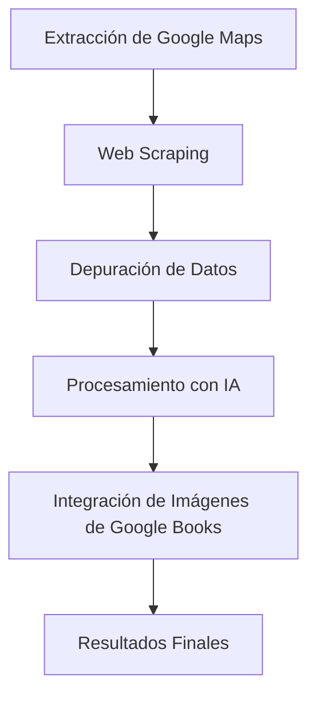
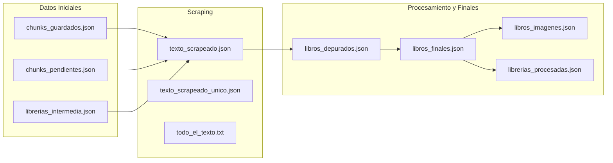

# 📚 Proyecto de Análisis de Librerías en Pichincha y Pastaza

**Recopilación, depuración y análisis integral de catálogos de libros**

## 📌 Descripción del Proyecto

Este proyecto tiene como objetivo **crear una base de datos completa, depurada y estandarizada de los libros disponibles en librerías de Pichincha y Pastaza (Ecuador)**.
El enfoque incluye la recopilación de información desde Google Maps, scraping directo de librerías, depuración avanzada, estandarización de imágenes con Google Books y uso de IA para extraer información útil.

Con esta base de datos consolidada, es posible responder preguntas relevantes como:

- ¿Cuál es el libro más popular entre varias librerías?
- ¿En qué librería se consigue un libro al mejor precio?
- ¿Dónde está disponible un libro específico?
- ¿Qué libros se repiten entre librerías y cuáles son únicos?

Además, las imágenes obtenidas desde Google Books permiten **mantener un catálogo visual uniforme**, especialmente útil cuando se agreguen nuevas librerías en el futuro.

---

## 🔄 Flujo de Trabajo

### 1. **Extracción de datos desde Google Maps**

- Identificación de librerías de Pichincha y Pastaza.
- Obtención de nombres, direcciones, enlaces y datos básicos.
- Utilización de API.

### 2. **Web Scraping**

- Extracción del contenido disponible en las páginas de las librerías.
- Captura de:

  - Títulos
  - Autores
  - Precios
  - Fragmentos textuales

- Herramientas utilizadas:

  - `requests`
  - `BeautifulSoup`
  - `Selenium`

### 3. **Depuración de Datos**

- Eliminación de duplicados y textos irrelevantes.
- Normalización de títulos y autores.
- Corrección de errores comunes y estandarización de estructuras.
- Almacenamiento en JSON/TXT para procesamiento posterior.

### 4. **Procesamiento con IA**

- Uso de modelos NLP para:

  - Identificar libros dentro de textos desordenados.
  - Corregir variaciones de un mismo título/autor.
  - Detectar libros repetidos.

- Tecnologías:

  - `spaCy`
  - `transformers`

### 5. **Obtención y Estandarización de Imágenes**

- Consulta a Google Books por título/autor.
- Creación de un archivo JSON unificado con las URL de las imágenes que servirá para futuras ampliaciones del proyecto.

---

## 🗂️ Estructura de Archivos

### **Datos Iniciales**

- `chunks_guardados.json`
- `chunks_pendientes.json`
- `librerias_ecuador_pichincha_pastaza_intermedia.json`

### **Datos Scrapeados**

- `texto_scrapeado.json`
- `texto_scrapeado_unico.json`
- `todo_el_texto.txt`

### **Depuración y Procesamiento**

- `libros_depurados.json`
- `libros_finales.json`

### **Resultados Finales**

- `libros_imagenes.json` **(imágenes unificadas de libros)**
- `librerias_procesadas.json` **(información completa lista para usar)**

### **Notebook Principal**

- `Web Scraping Librerias Pichincha Pastaza.ipynb`

---

## 📦 Archivos Finales del Proyecto (Datos Consolidados y Listos para Usar)

Los archivos que contienen **toda la información procesada en su versión final** son:

### ✔️ **`librerias_procesadas.json`**

Archivo maestro que consolida:

- Listado de libros por librería
- Precios
- Datos de contacto
- Información completamente depurada
- Estructura lista para análisis, dashboards o aplicaciones externas

### ✔️ **`libros_imagenes.json`**

Base de datos unificada de imágenes obtenidas mediante Google Books.
Permite:

- Mantener una imagen única por libro
- Reutilizar la misma imagen cuando se agreguen nuevas librerías
- Evitar duplicados visuales

Estos dos archivos representan el producto final del proyecto y son la base para análisis futuros como comparativas de precios, rankings de popularidad o sistemas de búsqueda de libros.

---

## 📊 Diagrama del Flujo General

---

## 🗃️ Diagrama de Estructura de Archivos

---

## 🛠️ Herramientas Utilizadas

- **Python (Jupyter Notebook)**
- **Web Scraping:** `requests`, `BeautifulSoup`, `Selenium`
- **Procesamiento de datos:** `pandas`, `json`
- **NLP e IA:** `transformers` , `Qwen/Qwen2.5-3B-Instruct`
- **Visualización de flujo:** Mermaid

---

## 🎯 Objetivo Final

Construir un **repositorio unificado de información sobre libros y librerías**, totalmente procesado y listo para:

- Comparar precios entre librerías
- Encontrar en qué librerías está disponible un libro
- Analizar popularidad y repetición
- Crear dashboards o buscadores inteligentes
